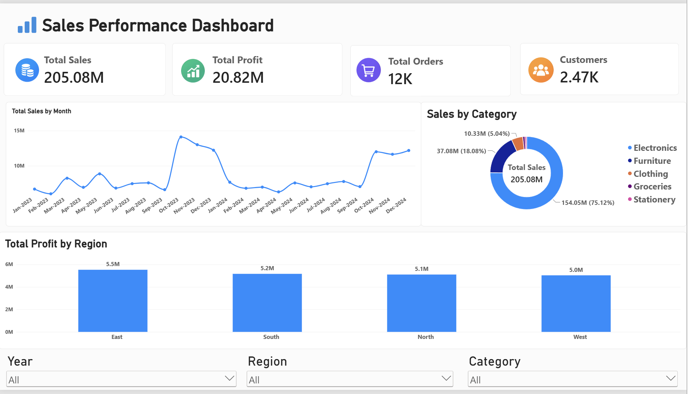
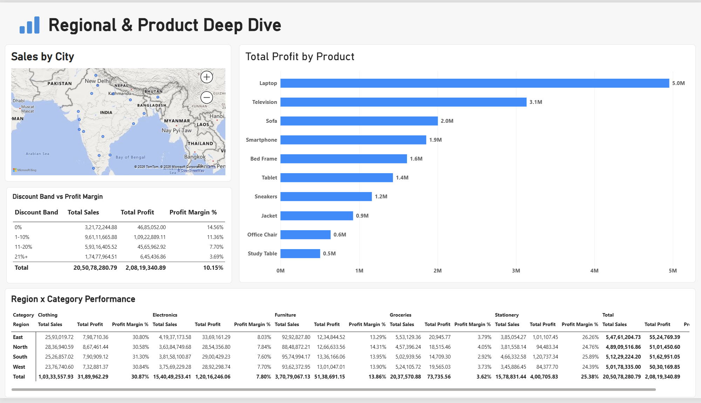
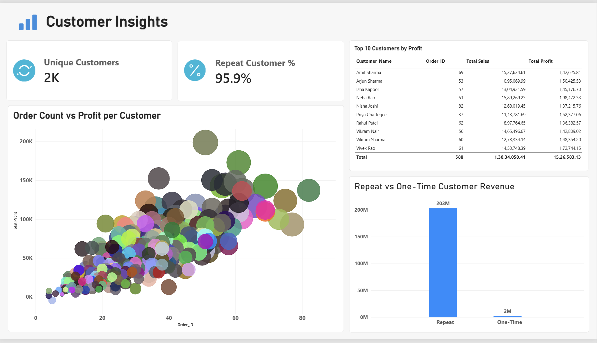

# Retail Sales & Business Performance Analytics

**Tools used:** SQL (MySQL), Excel, Power BI
**Dataset:** 12,000 orders, 2,470 customers, Jan 2023 – Dec 2024

## Why I built this

I wanted a project that actually mirrors how a retail business would use
data day to day — not just one chart, but the full pipeline: raw data,
SQL for the heavy analysis, Excel for quick formula-driven views, and
Power BI for a dashboard leadership could actually click through.

The scenario I set for myself: a retail company wants to know what's
driving (and hurting) their sales and profit across regions, categories,
and customers.

## Dataset

- `Retail_Sales_Raw_Data.csv` — one row per order (14 columns: order id,
  date, customer, category, product, region, city, quantity, sales,
  discount %, profit, shipping mode, payment mode).
- `Customers.csv` — one row per customer, with a `home_region` field
  (the region a customer orders from most). I split this into its own
  table on purpose, so the SQL work involves a real fact/dimension JOIN
  instead of one flat file, and so I could compare a customer's home
  region against where an order actually shipped.

## Files

| File | What it is |
|---|---|
| `Retail_Sales_Raw_Data.csv` | Orders (fact table) |
| `Customers.csv` | Customer dimension table |
| `Retail_Sales_Analysis_MySQL.sql` | Schema + 13 queries, MySQL 8.0 |
| `Retail_Sales_Analysis.xlsx` | Raw data + 5 formula-driven analysis sheets |
| `PowerBI_DAX_Measures.txt` | Data model + DAX measures used in the dashboard |
| `Retail_Sales_Dashboard.pbix` | 3-page Power BI dashboard |

## What I did

1. **Data modeling** — kept orders and customers as separate tables so the
   SQL includes a proper JOIN, closer to how a real database is set up.
2. **SQL** — 13 queries covering aggregation, CTEs, window functions
   (`RANK`, `ROW_NUMBER`, `LAG`, running totals with `SUM() OVER`), a
   correlated subquery, and JOINs.
3. **Excel** — KPI, Regional, Category, Monthly, and Top Customer sheets,
   all built with live formulas (`SUMIF`, `COUNTIF`, `AVERAGEIF`) so they
   recalculate if the raw data changes.
4. **Power BI** — a proper Date table, custom DAX measures, and a 3-page
   dashboard: Executive Overview, Regional & Product Deep Dive, and
   Customer Insights.

## Key findings

- **Electronics brings in the most revenue but the thinnest margin** —
  it's the top category by sales, but its margin (~8%) is far below
  Clothing (~31%) and Stationery (~25%). High revenue, low profitability.
- **Discounting is clearly eating into margin.** Orders with 0% discount
  run about 14.6% margin; orders at 21%+ discount drop to around 3.7%.
  That's a real case for tightening discount policy above ~20%.
- **The East region generates the most total profit**, even though it
  doesn't always have the most orders — points to a more profitable order
  mix there rather than just higher volume.
- **95.9% of customers are repeat buyers**, and they account for the vast
  majority of total revenue (₹203M of ₹205M) — retention matters more
  here than acquisition.

## How to run it

- **SQL:** open `Retail_Sales_Analysis_MySQL.sql` in MySQL Workbench 8.0.
  Run the schema block first, import the two CSVs via the Table Data
  Import Wizard, then run each query one at a time.
- **Excel:** open the workbook — everything outside `Raw_Data` is a live
  formula, so changing a value there updates the other sheets.
- **Power BI:** open the `.pbix` file directly, or rebuild it from
  `PowerBI_DAX_Measures.txt` if you want to see the model from scratch.

## Limitations

- Synthetic dataset, not a live production feed.
- No cost-of-goods breakdown beyond profit, so margin analysis is at the
  order level, not the SKU-cost level.
- No marketing spend data, so I can't tie sales lift to campaigns.

## Dashboard Screenshots
### Executive Overview

### Regional & Product Deep Dive

### Customer Insights

